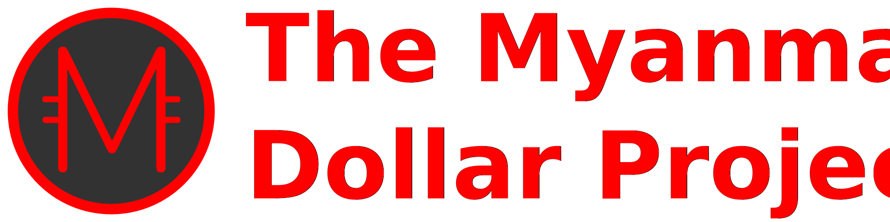

    

---

### What is The Myanmar Dollar?

The Myanmar Dollar (MYD) is a digital currency protocol based on Nano, but distributed only and evenly to Myanmar citizens. It is a digital payment protocol designed to be accessible and lightweight, with a focus on removing inefficiencies present in other cryptocurrencies. With ultrafast transactions and zero fees on a secure, green and decentralized network, this makes MYD ideal for everyday transactions.

---

### Guides & Documentation

* [Whitepaper (MYD) - Coming soon](https://www.myd.money)
* [Running a Node (Nano)](https://docs.nano.org/running-a-node/overview/)
* [Integration Guides (Nano)](https://docs.nano.org/integration-guides/the-basics/)
* [Command Line Interface (Nano)](https://docs.nano.org/commands/command-line-interface/)
* [RPC Protocol (Nano)](https://docs.nano.org/commands/rpc-protocol/)

Other documentation details can be found at [here](https://docs.nano.org).

---

### Links & Resources

* [MYD Website](https://www.myd.money)
* [Documentation (Nano)](https://docs.nano.org)
* [MYD Discord Chat](https://discord.gg/6UwW5TDkps)
* [MYD Facebook](https://www.facebook.com/MyanmarDollar)
* [MYD Telegram](https://t.me/the_myanmar_dollar)
* [MYD Twitter](https://mobile.twitter.com/MyanmarDollar)

---

### Contact us

We want to hear about any trouble, success, delight, or pain you experience when
using MYD. Let us know by [filing an issue](https://github.com/TheMyanmarDollar/the_myanmar_dollar/issues), joining us on [Telegram](https://t.me/the_myanmar_dollar), or joining us on [Discord](https://discord.gg/6UwW5TDkps).
